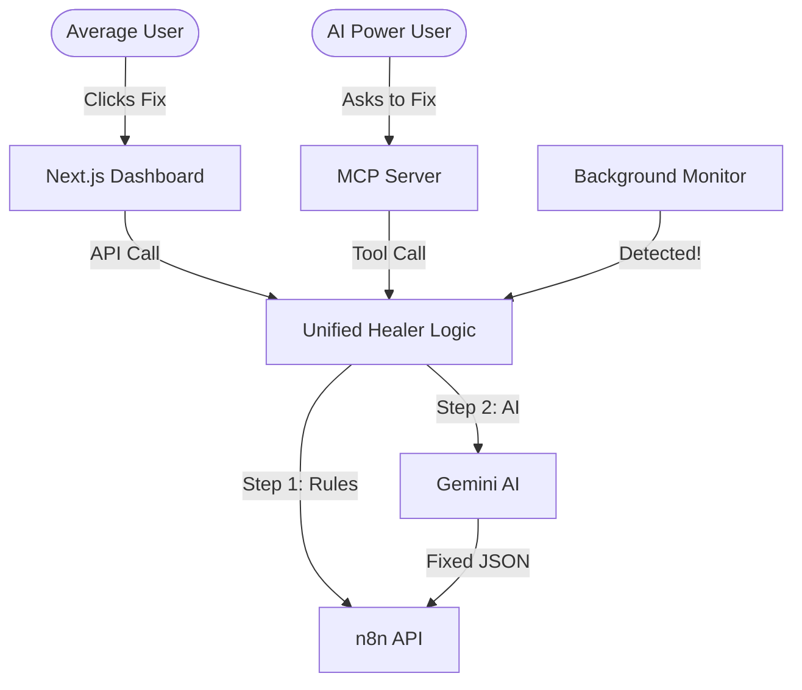

# How It Works: The "Two-Way" System

Think of your project as a **remote-controlled car** that also has its own **dashboard**.

## 1. The Shared Brain (`core_healer.py`)
Previously, we had separate logic for the dashboard and for the background monitor. Now, they both use the same "Brain."
-   **If a "Connection Error" happens**, the Brain knows to "Retry."
-   **If a "Syntax Error" happens**, the Brain knows to call Gemini AI.
-   **Consistency**: No matter how you fix it, the fix is the same.

## 2. The Two Ways to Use It

### Way A: The Dashboard (For Humans)
- **Interface**: Your Next.js web page.
- **Workflow**: You see a red "Fault," you click the button, the API calls the **Shared Brain**, and the workflow is fixed.
- **Best for**: Checking status at a glance and manual control.

### Way B: The MCP Server (For AI)
- **Interface**: Claude Desktop or Cursor Chat.
- **Workflow**: The AI (Claude/Cursor) uses the **MCP Server** to "look" at your N8N. It sees a failure, calls the **Shared Brain** itself, and fixes it.
- **Best for**: Truly autonomous healing while you are coding or working in Claude.

## 3. The Visual Flow

## Summary
- **FastAPI (`api.py`)**: The bridge for the Dashboard.
- **MCP Server (`mcp_server.py`)**: The bridge for Claude/Cursor.
- **Agentic Healer (`agentic_healer.py`)**: The background monitor that watches while you sleep.
- **All of them** call `core_healer.py` to do the actual work.
